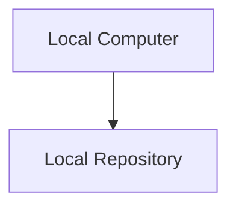
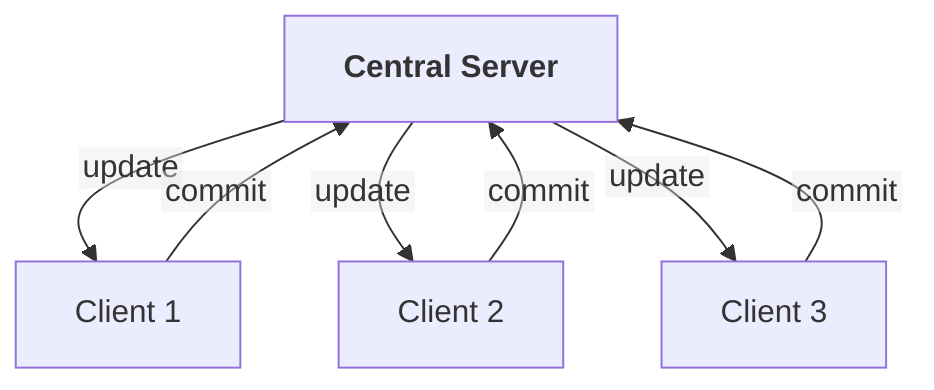
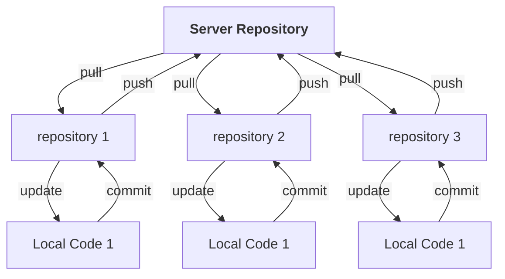

# Git-Workshop Repository

This is the repository for the GitHub Workshop

## Introduction to Git

This section is for a comprehensive understand of Version Control Systems, Git, GitHub, and Code Collaboration.

### What is Git?

Git is a distributed version control software system that is used to manage versions of source code data.

### Why should you use Git?

If you plan on working in industry under any Computer Science profession, it is typically expected that you have some experience with a version control system.

Git provides a rich set of commands that allow for both high and low-level control over your source code.

Git is one of the largest open sourced projects online and it under the GNU General Publish License version 2.

[Git Source Code](https://github.com/git/git)

## What is a Version Control System?

A Version Control System is a software tool that helps tracks and manages changes to source code.

Version Control Systems provide developers a way to:

1. Track updates and changes to codebases
1. Collaborate on code without running into overwriting issues
1. Revert to previous versions
1. Maintain a history of your codebase

### Types of Version Control Systems

Version Control Systems can implement different architectures depending on their use cases. These systems include:

**Local Version Control Systems (Local VCS)**

Local VCS run entirely on personal machine without need to connect to network. The code repository is stored locally.



All changes are stored locally, which is helpful for individual projects but does not facilitate collaboration.

**Centralized Version Control System (Centralized VCS)**

Uses a central server to store state of source code and update clients. Developers connect their clients to access or modify files.

The Central Server get changes to the repository from clients when one of them makes a commit. The Server then updates the other clients that there has been a change to the code base.



This gives administrators administrative management over source code while also allowing developers to collaborate on one source code.

The biggest flaw is that a Centralized VCS presents a single point of failure. If the server goes down, the source code goes with it.

**Distributed Version Control Systems(Distributed VCS)**

Distributed VCS use multiple repositories. Each user has their own repositories and can use server repository. When committing to this repository, other users will not have access to that commit, since that is to your local repository.

In order for others to see the commits that you have made, you need to not only make a commit to your repository, but also push that commit to a server.

Other users will need to pull those commits in order to see their code.



## Installing Git

Git provides the instructions to install and get running Git on your machine. To access those instructions,
click on the link here: [Install Git](https://git-scm.com/book/en/v2/Getting-Started-Installing-Git)

To teach some of the essentials for the Git command line,

## Getting started with Git

After installing Git, the first thing to do is to create your own repository and
start coding.

To create your repository, run the following commands in your Terminal Application

```bash
# Create the directory that will hold your repository
mkdir my-repo

# Initialize a repository in your code
git init

# Open your repository
cd my-repo

# create a file in your repository
touch my-first-file.txt
```

## Getting Started with this Repository

To get started working with this Repository, open a Terminal Application of your choice and run the following commands.

```bash
# Enter your home directory
cd ~

# Clone this repository to Git-Workshop
git clone https://github.com/Florida-Poly-IEEE-Computer-Society/Git-Workshop.git

# Open repository
cd Git-Workshop

```
